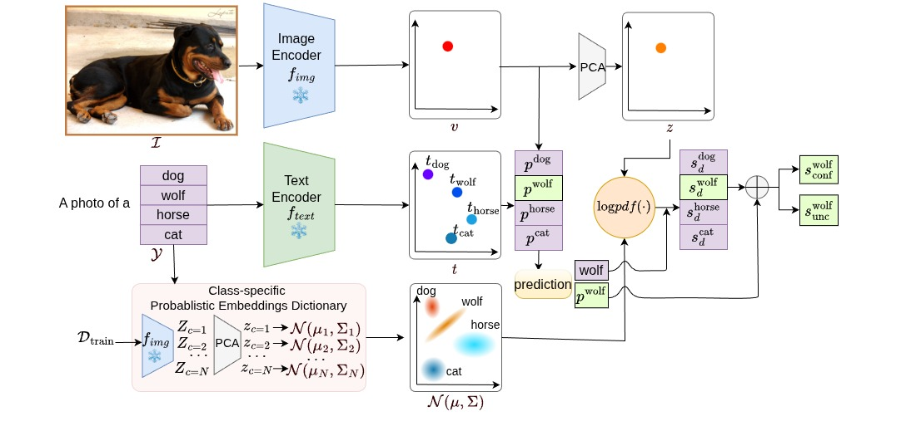

# Intra-Class Probabilistic Embeddings for Uncertainty Estimation in Vision-Language Models

<!-- 
 -->

This is the official code for WACV 2026 paper [Intra-Class Probabilistic Embeddings for Uncertainty Estimation in Vision-Language Models]()

**The code will be released soon.**
